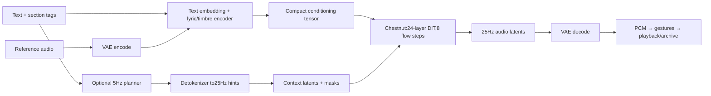

> **September16 stability update from b719139:** See [ACE_STABILITY.md](ACE_STABILITY.md) for the current acceptance result and [the port review](results/ace_stability_20260916/index.html). The engineering history below predates the stronger paired tests. Warm fixed-window generation and multiple replay/soak runs pass, but official-reference interior silence and three intermittent GPU/link failures keep overall acceptance open. No general alignment or mixed-precision optimization was promoted.

# ACE-Step Chestnut engineering — from1c00780

Human accepted ACE's musical superiority and seamless verse→chorus example. ACE is now primary composition candidate; SA3 stays intact as fallback. YuE's unwanted vocals, silence and execution burden remove it from this pass's priorities. All physical output stays muted; work remains private/offroad.

## First measured boundary

Exact safetensor element census: main decoder/DiT1,575,458,880 parameters (3,150,917,760 FP16 bytes); condition encoder608,367,616; detokenizer105,011,776; audio tokenizer105,032,198; null embedding2048. This supports testing staged residency instead of assuming the entire package must fit.

The first trained sliding-attention block executes on Chestnut. After54.25s initial kernel compilation and1.45s capture, repeated execution took15.8–16.0ms for160 tokens and48 conditioning tokens. Peak process RSS145.35MiB; tracked GPU139.83MB; loaded parameter bytes134.26MB. Relative output RMSE0.000890 and cosine0.9999983 against Torch FP16. The initial fixed absolute-error limit0.05 failed (max0.25), because these synthetic trained-weight activations reach170.5; peak-normalized error is0.001466. Preserve this failed assertion and use scale-aware metrics plus full real-input validation next. This is a component result, not generated-audio success.

Operator path so far: dense matmul, FP32 RMS reduction with FP16 output, split-half RoPE, grouped-query attention, bidirectional sliding mask, cross-attention, gated SiLU feedforward and AdaLN. All execute through native tinygrad; no PyTorch compatibility layer. Full/sliding attention at long duration is performance-sensitive. Input/output convolution uses non-overlapping two-frame patches and can be represented exactly by reshape/linear transforms.

Initial experiment uses the Mac to prepare/cache actual conditioning and reference data, keeping planner/encoders off Chestnut while validating the heavy DiT. This is host-assisted research, not a permanent Mac requirement or proof that comma CPU can perform all preparation within budget. Main-model residency, activations and decode will be measured before choosing quantization or staging.

## Full trained stack milestone
The actual 15-second conditioning path has 375 latent frames and 243 conditioning tokens. The FP16 native 24-layer DiT matches an independent official FP16 MPS forward at relative RMSE 0.005884 and peak-normalized error 0.009549. Both satisfy the preselected 1% criteria. Main weights: 3,150,917,760 bytes; tracked end allocation: 3,160,789,808 bytes; process peak host RSS: 179.14 MiB. These are tracked allocation/end values, not proof of modeld coexistence.

Initial default tinygrad kernels: 32.41 s weight load; 43.88 s first forward; 22.47 s capture; 4.97 s warm forward. Actual eight-step generation: 40.40 s for 15 s audio (latent RTF 2.69). Official host VAE has decoded these latents to a WAV; this first audio path is explicitly host-assisted and is not a local standalone deployment. Initial PCM export clipped peaks above one; the listening copy uses documented uniform peak normalization.

A concrete optimization hypothesis is under test: tinygrad defaults TC_OPT=0 and rejects matrix-tile padding unless TC_OPT>=2. The initial synthetic block had tile-aligned lengths160/48, whereas real inputs have lengths188/243. Enable the existing safe padding optimizer, repeat numerical validation, and measure before changing the model architecture or reducing precision. Preserve both original and optimized evidence.

## Matrix padding result
`TC_OPT=2` enables existing tensor-core tile padding without changing the model. It reduced warm DiT forward from4.97s to0.685s and actual15s eight-step generation to5.872s (latent RTF0.3915). The first optimized attempt failed the FP16 peak-normalized1% gate at1.0896%, despite improved RMSE. An independent comparison against the already-captured official FP32 output passes the unchanged1% limits: RMSE0.4284%, peak-relative0.6511%, cosine0.9999908. Both attempts and the precision audit are preserved. This is numerical evidence, not subjective listening approval.

The sampler presently uses eight-step Euler with DCW disabled; the initial official reference audio used default DCW. Numerical DiT comparisons are unaffected by that sampler distinction. Listening comparisons must identify it. Native VAE also passes: synthetic reference relative RMSE0.2214%, warm0.481s for1.28s output,216MB tracked GPU and284MiB host peak. Actual full-length decode and duration scaling are under measurement.

## Reference, continuation, and the host boundary
The initial human-approved transition is reference-conditioned generation, not proof of exact prefix continuation. This pass captures actual official repaint requests:12s of already-generated musical context plus28s to generate; explicit mask has300 preserved and700 generated latent frames. The native conditioning prefix exactly equals the clean source prefix. Repaint injects the noised clean source for the first4 of8 Euler steps, then performs the official12-frame boundary blend. DCW is explicitly disabled in these matched repaint requests. This is a small sampler extension, not another model/runtime.

Potential self-contained runtime for a prepared identity: persist text/reference encoder output and the silence/context template, put the previous generated latent tail into the new prefix, and generate/decode on Chestnut. Preparing a new identity/arbitrary text still needs the unported planner/conditioning stack; this pass currently prepares it on the Mac. Shipping prepared embeddings does not demonstrate on-comma arbitrary-prompt preparation. No permanent Mac transport is inherently needed by the DiT/VAE loop, but that loop still needs validation and replay integration.

## Quantization scope
FP16 fits. A bounded per-row INT8 storage experiment is prepared (271 matrices, payload1,578,352,768bytes versus3,150,917,760bytes). It transfers INT8 and dequantizes once on GPU into resident FP16. Thus it may improve startup/transport and trades weight fidelity; it does **not** claim lower resident FP16 memory or native INT8 matrix multiplication. Only retain it if benchmark and listening evidence justify the trade. No lower-bit or broad compatibility work is planned merely to force a pass.

## First complete decoded benchmarks and stability limit
15s:5.913s generation +1.508s native decode =7.420s, RTF0.495.30s:10.717s +1.828s =12.546s, RTF0.418. Actual full native VAE output matches official FP32 decoding of the same generated latents at relative RMSE0.000890. Listening approval remains pending. Payload normalization is documented and preserves dynamics.

Cold work remains substantial: main load~32s, VAE~6s, initial forward~72s plus26s capture; first15s VAE call205s plus8s capture. These are not included in warm RTF. A readiness/prebuffer stage is mandatory.

The combined15→30→45 run **hung during45s sampling after a valid1.781s warm forward**: USB copyin drain exceeded10s, then GPU timeline failed. No45s generated/decode result is claimed. Owned process was terminated, power snapshot restored, and a new isolated retry was launched with explicit synchronization before timestep USB transfer and a bounded decoder. The root cause is not yet established; do not call this a stable continuous or production pass based only on warm throughput.

At30s the end tracked allocation was5.007GB and host peak520MiB. Retaining full-length decoder graphs at several lengths is unnecessary. The bounded decoder uses375latent-frame windows,250-frame cores, and at least62frames of interior context, discarding overlap rather than audio crossfading. It will be compared with a full decode; exact chunk equivalence is not assumed.

For arbitrary identities, native Qwen preparation remains unported. Both actual configs have28layers,8KVheads,128head dimension. An FP16 autoregressive KV cache costs114,688bytes per token (~235MB at2048tokens); text encoder can be run without persistent decode cache. Planner, text encoder, conditioning encoder, DiT, and VAE can have separate lifetimes. Present Mac preparation for60/90s measured28.74/27.75s, excluding service initialization. Do not treat those as comma CPU measurements.

## Minimum runtime/buffer design
- Prepare identity and role embeddings before playback; retain only compact tensors. This is currently a Mac development step and should be clearly surfaced as preparation, not hidden inside a claimed comma benchmark.
- Keep the FP16 DiT resident, plus a bounded-window VAE. Heavy waveform generation stays on Chestnut. CPU owns seeds, small sampler bookkeeping, request scheduling, and final arrangement/capture.
- Generate a first30–60s section before starting playback. A cold device is not ready after simply loading weights: graph construction/capture must also complete.
- For later sections, preserve the actual previous12s latent tail and repaint the next28s. Keep at least generation-time plus jitter in the playback buffer. Measure RTF against **new28s**, not the40s output containing its old prefix.
- Current nav horizon may request an outro while the destination is still tens of seconds away; model trajectory gestures still own curve timing. Never inspect future recorded route points to schedule music.
- Keep final PCM/clock/archive independent of the composer. A generic result needs new-audio boundaries, context duration, wall time, identity/preparation provenance, and capability metadata; SA3-specific latent-frame constants must not be reused for ACE.
- SA3 remains an intact alternate backend. An ACE→SA3 continuous handoff would require a validated codec/conditioning bridge and musical review; it is not an automatic fallback merely because both models make WAVs.

For RTF `r`, steady buffer slope is `1/r - 1` seconds per second. `r<1` can build margin; `r>1` drains any finite prebuffer eventually (lifetime `B0/(1-1/r)`). A large initial buffer cannot make a persistently slower composer continuously viable. The current15/30s warm device results have margin, but the USB hang prevents claiming sustained reliability yet. Additional Mac preparation costs must be included if generating new conditions per request; prepared-identity reuse is a different, explicit capability.

## Bounded-decoder duration results
Synchronized45s:14.578s generation +7.941s decode =22.518s (RTF0.500), tracked high-water4,196,265,570bytes; host405MiB. Repeated30s:10.801+4.591=15.392s (RTF0.513). Bounded30s PCM is bit-identical to the prior full native30s decode. Bounded45s versus official FP32 VAE: relative RMSE0.000856 and peak-relative0.007521.

60s exhibits a shape-dependent slowdown: warm forward8.781s, generation70.711s +decode9.357s =80.068s (RTF1.334), tracked peak4.219GB, host471MiB. A single explicit masked token-alignment experiment is prepared to test whether this is an avoidable kernel-shape issue.

90s produced finite(1,2250,64) latents, then the reused bounded decoder hit a30s GPU timeline timeout during output readback. Exact90s sampling time was not persisted before that failure, so do not infer an exact RTF from the warm-forward projection. Owned process was terminated and power restored. This second failure means explicit step synchronization is **not** established as a complete fix. Do not promote the new model into normal replay based on one short throughput pass. The next bounded check is a fixed-size sequential continuation loop, not a broad USB driver rewrite.

## Alignment gate and continued scope
The PCIe link remained down after the90s hang. A bounded offroad recovery using the installed controller's `set_pcie_power` protocol restored LTSSM0x78. No firmware was flashed, and the bench CPU power snapshot was restored. First alignment launch failed on link-down; the recovered launch is separate evidence.

Explicit32-token masked alignment reduced60s warm forward from8.78s to5.80s. Relative RMSE against official FP32 is0.003766 and cosine0.999992, but peak-relative error0.012502 failed the preselected1% maximum-error gate. The largest discrepancy is at frame1300 (not the padded tail), but no exact cause is established. **No aligned60s generation pass is claimed; it was not promoted into the prepared composer.** The shorter demonstrated configurations are sufficient to continue the bounded fixed-duration loop test without a major optimization project.

## Gesture listening derivatives
V2 introduces unpitched electronic click/tick/body/brush/riser/sweep voices and distinct call/answer timbres. There is no validated current-chord estimator, so the added voices do not synthesize guessed pitches. Turn signal has an activation phrase, lighter once-per-bar sustained pattern, and a finite release. The unchanged original bank is preserved.

Controlled60s A/B: zero late events; signal phrases26→7. Full archived571.6s dry-road remix: zero late events; signal phrases222→59, all started gesture events282→130; same54,873,600 channel samples with5 limiter-level samples in both versions. This uses each archived semantic state only at its original elapsed time, and is explicitly an offline listening derivative, not a new native/Mac replay or fresh ACE-generation acceptance run. Human salience/annoyance review is still required.

## INT8 storage decision
The native per-row INT8 round trip matches the equivalent quantized official forward (RMSE0.004861, peak-relative0.007073). It generated15s latents in5.991s, compared with5.872–5.913s for FP16. Load36.93s versus~32s; resident weights remain3.151GB by design. Original-weight drift is~4.14% relative RMSE against FP32. Thus the smaller stored payload provides neither a measured runtime nor resident-memory benefit here. **Keep FP16; do not promote INT8 or pursue lower bits just to claim quantization.** Its audio/metadata are preserved as an exploratory comparison.

## Sequential prepared backend passed
Condition-padding validation against official FP32: RMSE0.004092, peak-relative0.006095. A fresh native verse30s followed by four actual12s-prefix/28s-new repaint sections completed on one resident DiT/VAE instance. Every preserved prefix is bit-exact outside the12-frame blend. New sections were prechorus, chorus, bridge, and outro; concatenated listening duration142s. Warm complete call walls: chorus20.970s, bridge20.661s, outro20.364s per28s new audio (RTF0.749/0.738/0.727, including call overhead). Peak tracked allocation4,214,994,090bytes; host471MiB. First30s shape preparation was285s inside generate, and first40s shape124s; weight loading another38.74s. These cold costs must happen before replay playback.

The same resident decoder also recovered the prior90s latents to PCM in14.344s, confirming those latents were usable. It does not restore the missing original90s generation timing. The stable fixed-shape run supports a prepared/prebuffered experimental architecture; earlier link failures still preclude production/coexistence claims.

## Opt-in replay integration under test
`--composer ace` selects the prepared ACE worker; no flag preserves SA3. The renderer accepts explicit PCM append boundaries instead of reusing SA3 latent-rate constants. ACE initializes a58s generated buffer, then requests28s-new continuations when the existing buffer reaches30s. Current navigation chooses existing section intents; immediate events use V2 gestures. A weak tonal estimate uses source-tail release instead of guessing a cadence chord. Archive provenance identifies the actual backend. Existing route resolver, cereal bridge, PCM transport, clock guards, and stored-score mechanics remain in place.

68 unit tests pass including legacy/default selection, PCM boundaries, invalid-rate rejection, and weak-tonality behavior. Real Mac/native replay tests are next; no live acceptance result is inferred from unit tests or the synthetic section-flow run.

## Replay integration evidence (current pass)
The first Mac ACE replay used the existing normal camera/UI and cached community route for180s. It completed five fresh continuations in21.29–23.29s each (RTF0.760–0.832 per28s new audio), with minimum composer buffer6.6s, zero fallback loops, zero renderer underflows, and no request timestamp beyond its causal cutoff. Camera/path/lane drawing, navigation and seven curve activations were observed. However host delivery had46 starved callbacks and21,257 discarded late frames. **This is not a clean Mac audio acceptance pass.** Delays also occurred before any generation request; observed transport latency reached344ms against the unchanged250ms presentation buffer. No output timing tolerance was relaxed. Original capture and failed audit remain in`results/normal_1789585496`.

Mac stored-score regression independently passed120s with exact contiguous samples, no output flags, and0.604ms maximum clock-alignment error. This confirms the stored path; it does not repair the failed fresh transport capture.

Resident ACE preparation took447.8s from supervisor start to ready, including generating the initial58s and warming both generation shapes. This is a real pre-playback cost. During native replay the composer used~491MiB RSS (plus two~88MiB compiler helpers); the audio app~288MiB, replay~217MiB and UI~144MiB. System available RAM at that sample was815MiB without swap. These are a snapshot and process peaks where recorded, not a guarantee of memory safety with modeld.

The pre-existing resident supervisor initially reported a start timeout because its process detector only recognized SA3, while the ACE worker continued preparing successfully. The detector now selects the requested backend and checks both known worker owners. Existing readiness/GPU ownership guards prevent starting another model over an occupied accelerator. The first timeout is preserved rather than counted as a clean cold-launch result.

Native comma ACE regression completed the entire arrival route:254.3s captured, seven accepted fresh sections at21.57–21.81s per28s new (RTF0.770–0.779), minimum buffer8.1s, zero fallback loops/underflows/output flags, no generation errors, and no input timestamp beyond request cutoff. One already-generated closing request was correctly discarded after navigation revision. Normal camera received5,098 frames; paths/lanes rendered; ten curve activations and navigation were present. The normal default backend was not changed.

The causal arrival run played41.2s of generated outro before the final cadence trigger at239.15s. Weak tonal confidence0.0155 selected the source-tail release instead of a guessed chord. Final cadence ended at246.31s. This establishes scheduling and source provenance; whether the ending is convincing remains a human listening decision. Full final PCM and arrival excerpt are stored under the owning route's archive. No route assets were redownloaded or converted into future-aware runtime inputs.

## What this establishes, and what it does not

| Question | Evidence / remaining limit |
|---|---|
| Meaningful ACE execution and music on Chestnut? | Yes: trained FP16 DiT and native VAE, numerical reference checks, actual WAVs and a full native replay. |
| Practical precision/residency? | FP16 fits with bounded decoding. Keep DiT/VAE resident; prepared embeddings replace live planner/encoder residency. INT8 storage was not beneficial. |
| Continuous throughput? |28s new in~21.7s during native replay gives~6.3s per-cycle margin. Classify as demonstrated Level3 prebuffer viability, with Level4 throughput evidence on this bounded run; prior hangs prevent a sustained-reliability or Level5 claim. |
| Permanent Mac dependence? | The prepared-identity composer loop runs entirely on comma/Chestnut. New arbitrary-prompt preparation remains unported; do not call the whole product standalone yet. |
| Seamless transitions and convincing outro? | Actual latent-prefix continuation and sequential native flow are preserved, and early outro playback is verified. Musical acceptance still needs a human. |
| V2 signal/curve/nav gestures? | New timbres and finite signal activation/sustain/release patterns are integrated. Source-derived/unpitched voices avoid guessed harmony. Salience and annoyance remain listening questions. |
| In-rhythm / in-key guarantee? | No validated current-chord tracker. Gesture grid is estimated at initial preparation; tempo/phase tracking across evolving ACE sections is not yet proven. Strong harmonic claims are withheld. |
| Curve structural preparation + local payoff? | Nav chooses longer-horizon section intents; causal model forecasts drive local fill/apex gestures. There is no validated guarantee that a chorus lands exactly on every curve. A~6s curve forecast alone is too late for a~22s composer plus queued audio. |
| Lane-change gesture? | A listening example exists; automatic lane-change event wiring is not implemented. |
| SA3 hybrid/fallback? | SA3 remains a selectable independent backend. Seamless ACE→SA3 emergency handoff would require a validated codec/conditioning bridge and is not implemented or needed by the successful native buffer run. |
| modeld coexistence? | Untested. Peak tracked ACE allocation~4.215GB leaves nominal~4.325GB of8.540GB accelerator capacity, not guaranteed usable headroom. No GPU scheduling/preemption or modeld deadlines were evaluated. |

Current Mac preparation timings (separate from Chestnut):30s target22.20s total including4.38s planner;45s21.64s/6.19s planner;60s28.74s/7.58s planner;90s27.75s/11.21s planner. Initialization~34s is separate. Remainder includes encoding/conditioning and preparation overhead, not a clean isolated encoder benchmark. These are not comma CPU measurements.

Runtime division: Mac performs development-time planner/text/reference preparation; comma CPU handles request policy, seeds, small sampler bookkeeping, latent-prefix selection, gestures and PCM/archive; Chestnut executes all heavy DiT denoising and VAE waveform decoding. No remote/cloud generation is used.

## Final preservation checks
Native stored ACE replay passed120s: contiguous sample digest verified, zero output flags,8.104ms maximum clock error, no generation invoked by stored playback. A separately owned SA3 worker was preparing in parallel; the stored path itself did not request it.

Fresh default SA3 on the Mac passed the same community route for120s (114.5s captured): three accepted generations at20.325–20.392s per26.006s new, RTF0.782–0.784; no fallback/underflow/starvation/late frames/output flags; maximum host alignment error0.524ms; six curve activations and camera/path/lane drawing verified. This demonstrates the fallback still works after the adapter changes. It does **not** establish a root cause or a fix for the earlier ACE Mac transport failure. That requires a separate reproducible timing investigation before promoting Mac ACE replay as dependable.

All route launches used their normal IDs/resolver and causal cereal path. Existing arbitrary-route and archival tests remain intact; no new route-specific music rules, timestamps, or allowlist entries were introduced. Native full-route ACE final PCM is owned by its route library directory; listening derivatives are also route-owned. The prior unseen-route first-attempt evidence was not overwritten.

Cleanup verified: both owned resident services stopped; no composer/audio worker left running; normal comma UI restored; real`IsOnroad=False`; CPU settings exactly match the saved pre-worker snapshot. Both session mute locks remain. Mac output volume0/muted; its default output is built-in speakers, not Bluetooth. No speaker output or Bluetooth audio was intentionally enabled. All model artifacts and route scores stay private/local. Public StarPilot has no changes from this work.

Validation:68 integration/pure unit tests,5 V2 gesture tests, targeted worker-selection tests and the real-route future-mutation causality check passed. Listening-page local links resolve and no audio element autoplays. Subjective physical listening remains explicitly deferred.
